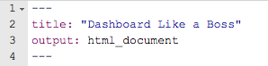
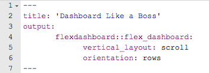

```{r setup, include=FALSE,warning=FALSE,message=FALSE}
knitr::opts_chunk$set(echo = FALSE)
# "... for your boss... and also probably PMs, POs, SMEs, directors, friends, neighbors, whatever--but mainly *FOR YOURSELF*"
     #   logo:  "onica_amazon_small.png"

library(readr)
library(dplyr)
library(readr)
library(RMySQL)
library(highcharter)
library(tidyverse)
library(lubridate)
library(DT)
library(summarytools)

kqed_alpha_palatte<-c(rgb(0, 0, 0, 0.8*256, maxColorValue =  256),rgb(249, 0, 58, 0.8*256,maxColorValue =  256), rgb(2, 170, 232, 0.8*256 ,maxColorValue =  256) , rgb(107, 121, 126, 0.8*256,maxColorValue =  256),rgb(27, 125, 161, 0.8*256,maxColorValue =  256))
#E80756
newtheme <- hc_theme_merge(
  getOption("highcharter.theme"),  
  hc_theme(colors = kqed_alpha_palatte #rev(c("#c8d3e5", "#6b8fb0","#18415d","#9e94a5","#352440")))#, "#5f4f78", "#9e94a5","#b7bbd0", "#766e9a", "#352440")) 
  #c("#b3cde0","#6497b1","#005b96","#03396c","#001a33" )) # "#011f4b"   c("#ffffcc","#a1dab4","#41b6c4","#2c7fb8","#253494")
  #c("#b3cde0","#a1dab4","#41b6c4","#2c7fb8","#253494")         
) )
options(highcharter.theme = newtheme)
```

```{css}
.gdbar img {
  width: 253px !important;
  height: 79px !important;
  margin: 8px 8px;
}

.gdbar {
  width: 400px !important;
  height: 95px !important;
}
.footer {
    position: fixed;
    left: 0;
    bottom: 0;
    width: 100%;
    margin: 5px;
   
    text-align: right;
}
slides > slide:not(.nobackground):before {
  width: 75px;
  height: 25px;
  background-size: 75px 25px;
}


```


# Why bother?

## Why should you DLAB? {.flexbox .vcenter}

- Pretty!

- Organized

- Interactive

- Reproducible

- Free

- *You get to use R*

- Flexible

- Better visualizations (sorry gg)

- People will respect you


## How to DLAB? {.flexbox .vcenter}

<h3>A 12 Step Program to Quit Emailing Plots & Csvs</h3>


## How to DLAB? | A 12 Step Program to Quit Emailing Plots & Csvs

1. Basic Layout
2. Printing: Tables,Descriptice Stats, Model summaries
3. Interactive Datasets
4. Interactive Plots
5. Exporting
6. CSS basics
7. Branding (Logos,  font, colors)
8. Header/Footer
9. Hosting
10. Automate-ish (render + system())
11. Replicate (render with arguments)
12. Automate or App it (cron, shiny runtime) 


## How to DLAB? | A 12 Step Program to Quit Emailing Plots & Csvs

 
<h5>1\. Basic Layout</h5>
<h5>2\. Printing: Tables, Descriptice Stats, Model summaries</h5>
<h5>3\. Interactive Datasets</h5>
<h5>4\. Interactive Plots</h5>
<h5>5\. Exporting</h5>


# 1. Basic Layout
<3 flexdashboard <3

## .Rmd + flexdashboard 
 
### Before :(
 

```{r,out.width = "400px"}

``` 

### After :)
 
```{r,out.width = "400px"}
knitr::include_graphics("Slide_images/yaml_after.png")
``` 


## flexdashboard layouts

### My go-to

```{r,out.width = "500px"}

```

*optional*: </br>

 + vertical_layout: \{scroll, fill\}

 + orientation: \{columns, rows\}

 
#  | print() is simply unacceptable
# 2. Printing Tables, Descriptive Stats & Model Summaries 


##   Tables, Descriptive Stats & Model Summaries

<center>
<h3>printr
</br>
</br>
summarytools::dfSummary
</br>
</br>
stargazer::stargazer</h3>
</center>

##   Table Printing: my go-to 

</br>
</br>
<h3> tables & descriptive stats:  **printr** </h3>
</br>
</br>
<h3> model summaries: **stargazer::stargazer** </h3>
</br>


##  Model Summary & Comparisons | stargazer::stargazer

Which model summary statistics do you wantto include in the output? Bookmark the link for later

https://rdrr.io/cran/stargazer/man/stargazer_stat_code_list.html

# 3. Interactive Datasets 

##  Interactive Datasets 

<center>


<h3>DT::datatable</h3>
</center>


## Datasets | DT::datatable 

* pretty printing

* flexible formatting

* column filtering

* csv download

* cell highlighting (think heatmap)


# 4. Interactive plots | We're not in PowerPoint anymore.

##  4. Interactive plots 
<center>
<h3>highcharter</h3></center>

</br>
</br>
</br>
</br>
</br>
ggplot2 will always have a place in your heart, but dashboards need more than pngs

##  4. Interactive plots 
<center>
<h3>highcharter</h3></center>

</br>
</br>
</br>
</br>
</br>
</br>
Other options
       
* *Maps*:    &nbsp;&nbsp;&nbsp;&nbsp;&nbsp;&nbsp;&nbsp;&nbsp;&nbsp;&nbsp;&nbsp;&nbsp;&nbsp;&nbsp;&nbsp;&nbsp;&nbsp;&nbsp;&nbsp;&nbsp;&nbsp;&nbsp;&nbsp;&nbsp;&nbsp;&nbsp;&nbsp;&nbsp;            leaflet 
* *Timeseries*:   &nbsp;&nbsp;&nbsp;&nbsp;&nbsp;&nbsp;&nbsp;&nbsp;&nbsp;&nbsp;&nbsp;&nbsp;&nbsp;&nbsp;&nbsp;&nbsp;&nbsp;&nbsp;&nbsp;       dygraphs
* *ggplot2 compatible*: &nbsp;&nbsp;&nbsp;&nbsp; plotly


# 4. Exporting 

## Exporting 

* Datasets with DT

* Highcharter Plots


## Dashboard LIKE A BOSS: pro tips | Let your dashboard work for you

SIMPLE 

> - Start with a simple template & someone else's css 
> - Add in the essentials or the lowest hanging fruit as you go

ORGANIZED

> - *Maintain a folder* containing: css, exporting scripts, color palletes, global themes, & templates
> - Keep a staging folder for exploration--*don't make changes you won't know how to undo*.
> - Keep expensive data cleaning in a separate script (easier to introduce it later than remove it after)

EXPLORE 

> - Try something new (template, plots, or css) to improve the appearance & usability of each new dashboard
> - Slowly work in:  About page & explanations,  interactive viz, exporting, logo, footer, padding/margins


## Resources |  github.com/maloriejhughes
<small> <div class="columns-2"> 
1. Basic Layout: 
    + R Markdown + <a href="https://rmarkdown.rstudio.com/flexdashboard/layouts.html">flexdashboard</a> 
2. Interactive Viz: 
    + All: <a href="http://jkunst.com/highcharter/">highcharter</a> 
    + Maps: <a href="https://rstudio.github.io/leaflet/">leaflet</a>, my leaflet <a href="https://github.com/maloriejhughes/Leaflet-tutorial">tutorial</a>
    + Timeseries: <a href="https://rstudio.github.io/dygraphs/">dygraphs</a>
    + ggplot2 compatible:<a href="https://plot.ly/r/">plotly</a>
3. Data/Tables
    + Datasets: <a href="https://rstudio.github.io/DT/">DT::datatable</a>
    + Tables & Summaries: <a href="https://cran.r-project.org/web/packages/printr/vignettes/printr.html">printr</a>
    + Meh IMO: <a href="https://mran.revolutionanalytics.com/snapshot/2018-01-16/web/packages/summarytools/vignettes/Introduction.html">summarytable</a>
4. Models
    + Model Summaries: <a href="https://www.jakeruss.com/cheatsheets/stargazer/">stargazer</a>
5. Exporting Data & Plots
    + highcharter
    + custom script
6. CSS (global settings: themes, layout, background, etc)
7. html ( in-line style/text changes, images, hyperlinks, web basics )
8. Branding ( css+html: custom fonts, global color themes, watermarks, etc)
9. Hosting
10. Automate-ish (render + system())
11. Replicate (render with arguments)
12. Automate or App it (cron, shiny runtime) 
</small>